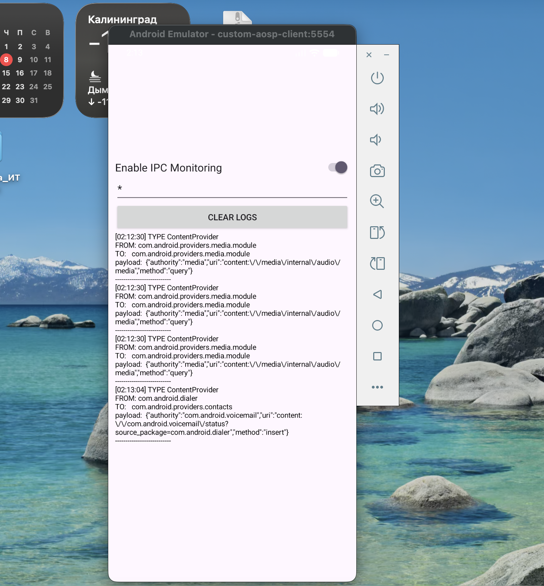

# Android Studio проект клиенсткого приложения на kotlin для получения данных об IPC взаимодействиях от Android

Само приложение устроено следующим образом: данные об IPC взаимодействиях предполагается получать от Android также через IPC взаимодействие `BroadcastReceiver`.  
На данный момент реализовано через патч в директории `aosp` только получение информации о `ContentProvider` IPC.  

## Полезные команды для запуска

- Для запуска эмулятора с "пропатченным" образом [aosp](../aosp) можно использовать следующую команду
  ```bash
  emulator -avd custom-aosp-client
  ```
- Для сборки и установки приложения можно использовать следующую команду
  ```bash
  ./gradlew assembleDebug && adb install -r app/build/outputs/apk/debug/app-debug.apk 
  ```
  Поскольку приложение для обработки опций и передаче их в Android использует `Settings.Global`, то для него также требуется выдать следующие права
  ```bash
  adb shell pm grant com.example.ipcmonitorclient android.permission.WRITE_SECURE_SETTINGS
  ```

## Примеры получаемых данных

Пример базовой реализации 



Пример получаемого от Android JSON о `ContentProvider` IPC:
```json
{
    "type": "ContentProvider",
    "sender": "com.android.dialer",
    "receiver": "com.android.providers.contacts",
    "payload": {
        "authority": "com.android.voicemail",
        "uri": "content://com.android.voicemail/status?source_package=com.android.dialer",
        "method": "insert"
    },
    "timestamp": 1767827584646
},
{
    "type": "ContentProvider",
    "sender": "com.android.dialer",
    "receiver": "com.android.providers.contacts",
    "payload": {
        "authority": "com.android.voicemail",
        "uri": "content://com.android.voicemail/status?source_package=com.android.dialer",
        "method": "insert"
    },
    "timestamp": 1767827649743
},
{
    "type": "ContentProvider",
    "sender": "com.android.dialer",
    "receiver": "com.android.providers.contacts",
    "payload": {
        "authority": "com.android.voicemail",
        "uri": "content://com.android.voicemail/status?source_package=com.android.dialer",
        "method": "insert"
    },
    "timestamp": 1767827649771
},
{
    "type": "ContentProvider",
    "sender": "com.android.dialer",
    "receiver": "com.android.providers.contacts",
    "payload": {
        "authority": "com.android.voicemail",
        "uri": "content://com.android.voicemail/status?source_package=com.android.dialer",
        "method": "insert"
    },
    "timestamp": 1767827779878
},
{
    "type": "ContentProvider",
    "sender": "com.android.dialer",
    "receiver": "com.android.providers.contacts",
    "payload": {
        "authority": "com.android.voicemail",
        "uri": "content://com.android.voicemail/status?source_package=com.android.dialer",
        "method": "insert"
    },
    "timestamp": 1767827779892
}
```