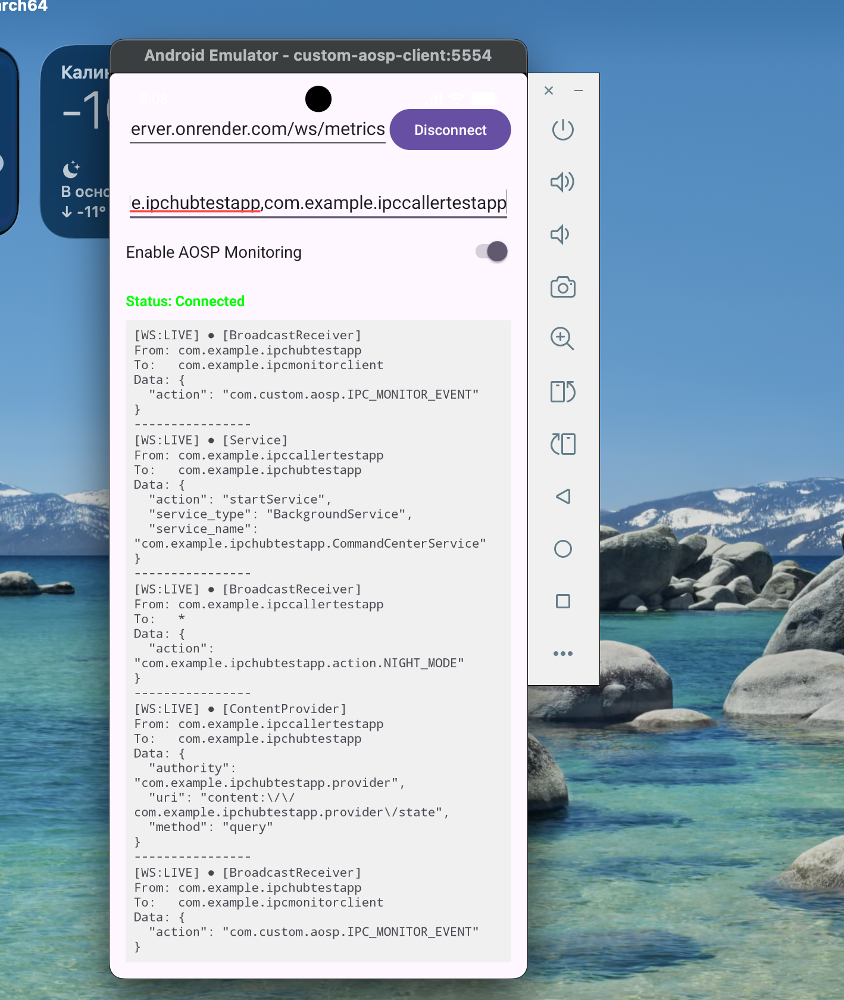
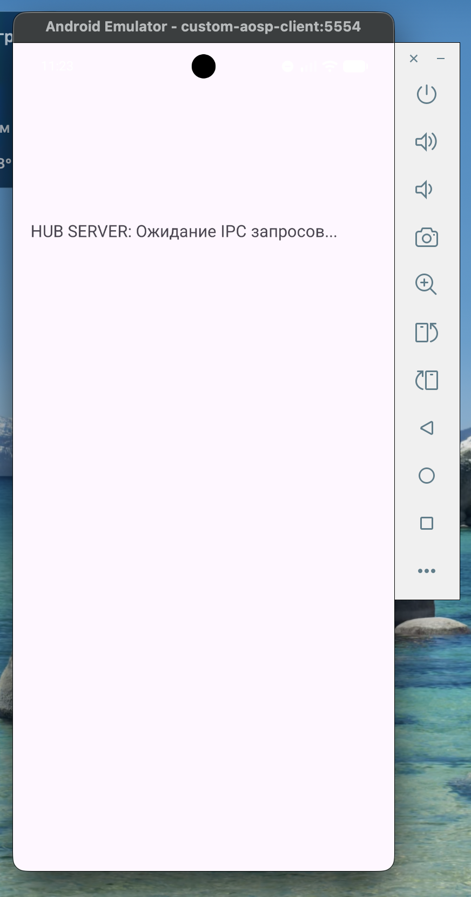
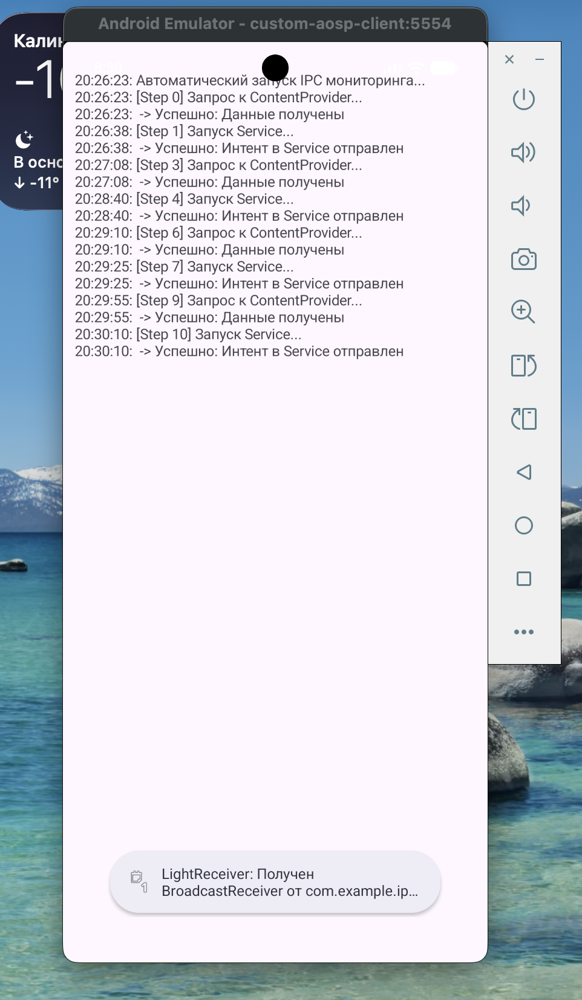

# Android Studio проект клиенсткого приложения на kotlin для получения данных об IPC взаимодействиях от Android

Само приложение устроено следующим образом: данные об IPC взаимодействиях (`ContentProvider`, `Service`, `BroadcastReceiver`) получаются от Android также через IPC взаимодействие `BroadcastReceiver`, визуализируются в приложении и при использовании соответствующей опции, через Websocket отправляются на указанный сервер для сбора и обработки данных.

## Полезные команды для запуска

- Для запуска эмулятора с "пропатченным" образом [aosp](../aosp) можно использовать следующую команду
  ```bash
  emulator -avd custom-aosp-client
  ```
- Для сборки и установки приложения можно использовать следующую команду
  ```bash
  ./gradlew assembleDebug && adb install -r app/build/outputs/apk/debug/app-debug.apk && adb shell pm grant com.example.ipcmonitorclient android.permission.WRITE_SECURE_SETTINGS
  ```
  Поскольку приложение для обработки опций и передаче их в Android использует `Settings.Global`, то для него также требуется выдать следующие права
- Команды для просмотра логов
  ```bash
  # Просмотр всех логов в ОС
  adb shell logcat
  # Просмотр логов на стороне ОС связанных с отправкой данных об IPC взаиодействиях клиенсткому приложению
  adb logcat -s IPC_MONITOR
  # Просмотр клиентских логов связанных с обработкой данных об IPC от ОС
  adb logcat -s IpcMonitorReceiver
  ```
- Команды для тестирования обработки IPC взаимодействий
  ```bash
  # Для тестирования обработки ContentProvider IPC
  adb shell content query --uri content://contacts/people
  # Для тестирования обработки Service IPC
  adb shell am start-foreground-service -n com.android.systemui/.keyguard.KeyguardService
  # Для тестирования обработки BroadcastReciever IPC
  adb shell am broadcast -a "com.android.ipc.TEST_WITH_EXTRAS" \
    --es "sender" "adb_shell" \
    --ei "value" 42 \
    --ez "flag" true \
    --esa "array" "one,two,three" \
    -c "android.intent.category.TEST"

  ```

Пример запущенного клиента для мониторинга IPC взаимодействий (`ContentProvider` и `Service`, `BroadcastReceiver`) с пропатченным исходным кодом AOSP.  



- В первом верхнем текстовом поле указывается адрес для подключения к серверу по протоколу Websocket для отправки полученных данных. Рядом находится кнопка для подключения/отключения к серверу.
- Во втором текстовом поле указывается фильтр для наблюдаемых приложений (`packages`) через зяпятую (пример: `com.example.ipchubtestapp,com.example.ipcmonitorclient`). События по IPC мониторингу попадают в фильтр, если в IPC взаимодействии указанный пакет присутствует в качестве `sender` **или** в качестве `receiver`.  
- Ниже располагается переключатель с возможностью включить/выключить отправку событий об IPC от Android (информация в Android передается через глобальные настройки системы).  
- И еще ниже, большую часть экрана занимает отображение полученных IPC событий от android

## Запуск тестовых приложений для демонстрации получения данных об IPC взаимодействиях

Для тестирования и демонистрации работы приложения `IPCMonitorClient`, были подготовлены еще два простых android приложения из папки [TestAndroidIPCApps](../TestAndroidIPCApps), которые обмениваются IPC взаимодействиями (`ContentProvider`, `Service`, `BroadcastReceiver`):
- [IPCHubTestApp](../TestAndroidIPCApps/IPCHubTestApp/) - тестовое приложение, представляющее собой Hub server, в котором реализованы `Service` и `ContentProvider`, при обращении `IPCCallerTestApp` для запуска соответствующего `Service`, оправляется `BroadcastReceiver` отправителю, при обращении к `ContentProvider` отдает соответствующие подготовленные данные. 
  
- [IPCCallerTestApp](../TestAndroidIPCApps/IPCCallerTestApp/) - тестовое приложение, имитирующее инициатора IPС взаимодействий с Hub Server. Раз в 15 секунд, отправляет к `IPCHubTestApp` запрос на запуск соответствующего `Service` и получение данных от `ContentProvider`. При получении `BroadcastReceiver` от `IPCHubTestApp` показывает Toast-уведомление на соответствующем экране. 
  

## Формат получаемых данных от Android

Пример получаемого от Android JSON о `ContentProvider`, `Serivce` и `BroadcastReceiver` IPC:
```json
{
    "type": "ContentProvider",
    "sender": "com.android.phone",
    "receiver": "com.android.providers.telephony",
    "payload": {
        "authority": "telephony",
        "uri": "content://telephony/siminfo/1",
        "method": "update"
    },
    "timestamp": 1768083376804
},
{
    "type": "Service",
    "sender": "android",
    "receiver": "com.android.providers.calendar",
    "payload": {
        "action": "bindService",
        "service_type": "BoundService"
    },
    "timestamp": 1768083381084
},
{
    "type": "BroadcastReceiver",
    "sender": "android",
    "receiver": "*",
    "payload": {
        "action": "android.net.conn.DATA_ACTIVITY_CHANGE"
    },
    "timestamp": 1768156960530
}
```