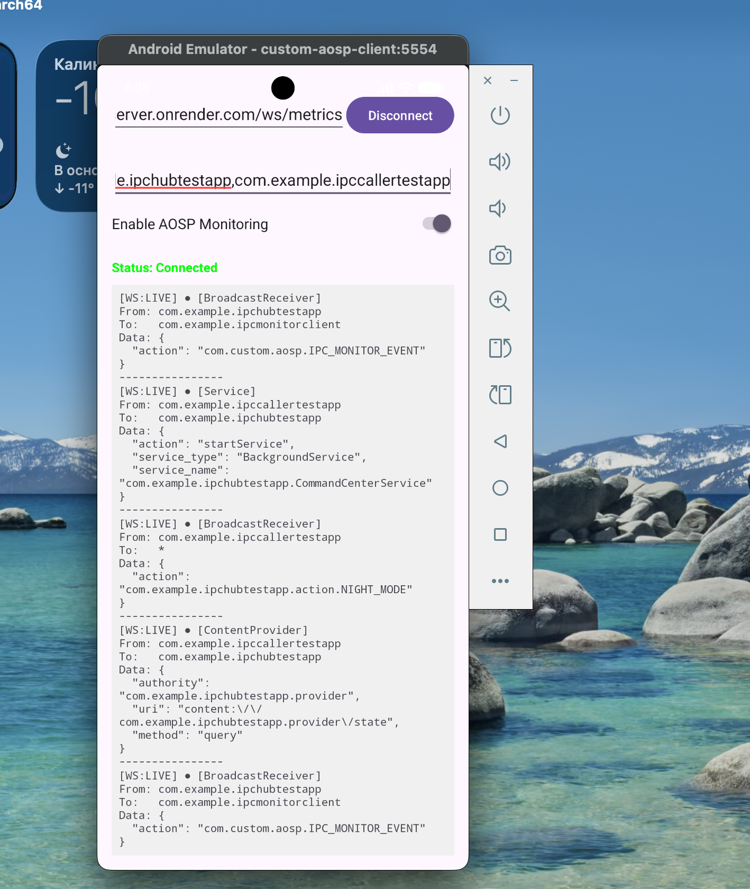
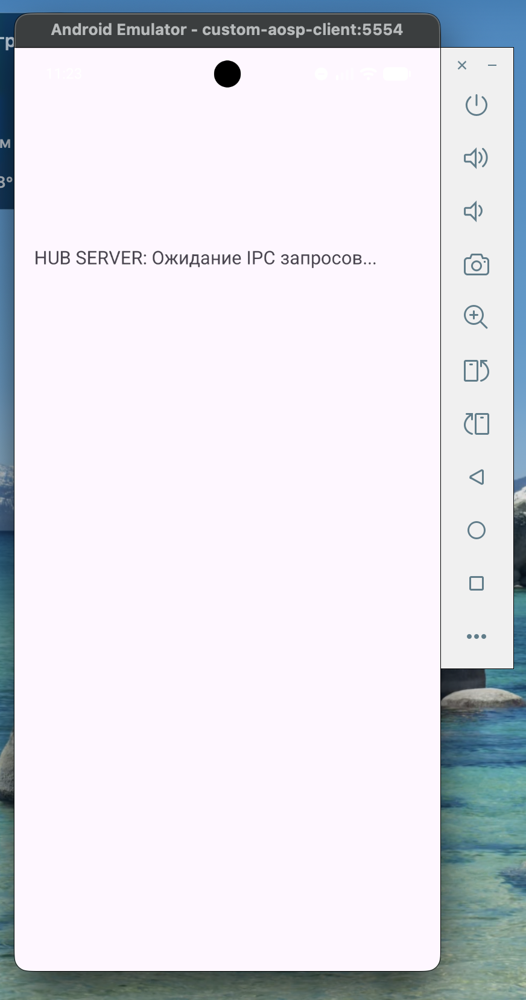
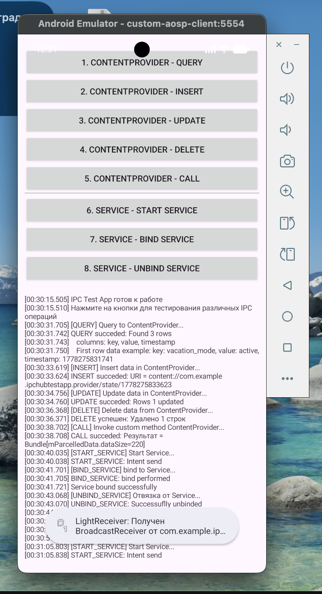

# Android Studio проект клиенсткого приложения на kotlin для получения данных об IPC взаимодействиях от Android

Пример запущенного клиента для мониторинга IPC взаимодействий (`ContentProvider` и `Service`, `BroadcastReceiver`) с пропатченным исходным кодом AOSP.  



- В первом верхнем текстовом поле указывается адрес для подключения к серверу по протоколу Websocket для отправки полученных данных. Рядом находится кнопка для подключения/отключения к серверу.
- Во втором текстовом поле указывается фильтр для наблюдаемых приложений (`packages`) через зяпятую (пример: `com.example.ipchubtestapp,com.example.ipcmonitorclient`). События по IPC мониторингу попадают в фильтр, если в IPC взаимодействии указанный пакет присутствует в качестве `sender` **или** в качестве `receiver`.  
- Ниже располагается переключатель с возможностью включить/выключить отправку событий об IPC от Android (информация в Android передается через глобальные настройки системы).  
- И еще ниже, большую часть экрана занимает отображение полученных IPC событий от android

Само приложение устроено следующим образом: данные об IPC взаимодействиях (`ContentProvider`, `Service`, `BroadcastReceiver`) получаются от Android также через IPC взаимодействие `BroadcastReceiver`, визуализируются в приложении и при использовании соответствующей опции, через Websocket отправляются на указанный сервер для сбора и обработки данных.  

Для включения мониторинга IPC взаимодействий и настройки фильтра наблюдаемых приложений, клиентское kotlin-приложение передает данные в ядро AOSP через глобальные настройки системы [Settings.Global](https://developer.android.com/reference/android/provider/Settings.Global) через следующие атрибуты:
- `itmo_yandex.ipc.monitoring_enabled` - атрибут типа int, если мониторинг включен, значение 1, иначе 0.
- `itmo_yandex.ipc.monitoring_packages` - атрибут типа string, который представляет собой фильтр наблюдаемых приложений (packages), перечисленных через запятую (пример: `com.example.ipchubtestapp,com.example.ipcmonitorclient`), приложение попадает в фильтр если оно указано как `sender` **или** как `receiver` в наблюдаемом IPC взаимодействии. Если приложения в фильтре не указаны, то по умолчанию наблюдаются взаимодействия между всеми (значение `*`).  

## Полезные команды для запуска

- Для запуска эмулятора с "пропатченным" образом [aosp](../aosp) можно использовать следующую команду
  ```bash
  emulator -avd custom-aosp-client
  ```
- Для сборки и установки приложения можно использовать следующую команду
  ```bash
  ./gradlew assembleDebug && adb install -r app/build/outputs/apk/debug/app-debug.apk && adb shell pm grant com.example.ipcmonitorclient android.permission.WRITE_SECURE_SETTINGS
  ```
  Поскольку приложение для обработки опций и передаче их в Android использует `Settings.Global`, то для него также требуется выдать следующие права
- Команды для просмотра логов
  ```bash
  # Просмотр всех логов в ОС
  adb shell logcat
  # Просмотр логов на стороне ОС связанных с отправкой данных об IPC взаиодействиях клиенсткому приложению
  adb logcat -s IPC_MONITOR
  # Просмотр клиентских логов связанных с обработкой данных об IPC от ОС
  adb logcat -s IpcMonitorReceiver
  ```
- Команды для тестирования обработки IPC взаимодействий
  ```bash
  # Для тестирования обработки ContentProvider IPC
  adb shell content query --uri content://contacts/people
  # Для тестирования обработки Service IPC
  adb shell am start-foreground-service -n com.android.systemui/.keyguard.KeyguardService
  # Для тестирования обработки BroadcastReciever IPC
  adb shell am broadcast -a "com.android.ipc.TEST_WITH_EXTRAS" \
    --es "sender" "adb_shell" \
    --ei "value" 42 \
    --ez "flag" true \
    --esa "array" "one,two,three" \
    -c "android.intent.category.TEST"
  ```
  Также для тестирования IPC взаимодействий между текущими установленными приложениями в системе, можно еще запустить monkey testing через adb со случайными событиями и нажатиями кнопок в разных приложениях
  ```bash
  adb shell monkey --pct-syskeys 0 --throttle 500 -v 500
  ```
  Результат запуска monkey testing представлен в файле [monkey_logs.json](./monkey_logs.json)

## Запуск тестовых приложений для демонстрации получения данных об IPC взаимодействиях

Для тестирования и демонистрации работы приложения `IPCMonitorClient`, были подготовлены еще два простых android приложения из папки [TestAndroidIPCApps](../TestAndroidIPCApps), которые обмениваются IPC взаимодействиями (`ContentProvider`, `Service`, `BroadcastReceiver`):
- [IPCHubTestApp](../TestAndroidIPCApps/IPCHubTestApp/) - тестовое приложение, представляющее собой Hub server, в котором реализованы `Service` и `ContentProvider`, при обращении `IPCCallerTestApp` для запуска соответствующего `Service`, оправляется `BroadcastReceiver` отправителю, при обращении к `ContentProvider` отдает соответствующие подготовленные данные. 
  
- [IPCCallerTestApp](../TestAndroidIPCApps/IPCCallerTestApp/) - тестовое приложение, имитирующее инициатора IPС взаимодействий с Hub Server. При нажатии на соответствующие кнопки в интерфейсе, отправляются запросы к `IPCHubTestApp`: методы `query`, `insert`, `update`, `delete`, `call` в ContentProvider и методы `startService`, `bindService` и `unbindService` для взаимодействия с комопнентом Service. При получении `BroadcastReceiver` от `IPCHubTestApp`, после запуска Service через `startService`, показывает Toast-уведомление на соответствующем экране. 

  

Для установки тестового приложения на устройство через adb, нужно перейти в соответствующую директорию и выполнить команду:
```bash
./gradlew assembleDebug && adb install -r app/build/outputs/apk/debug/app-debug.apk
```

Также для проверки того, что в рамках выполняемых между приложениями IPC взаимодействий, они все перехватываются разработанной системой мониторинга, был написан bash скрипт [check_ipc_interception_percentage.bash](./check_ipc_interception_percentage.bash), который выводит процент перехваченных взаимодействий (на основе логов приложения монитора) по отношению ко всем произошедшим в Android IPC взаимодействиям (все произошедшие события в Android извлекаются через [atrace](https://perfetto.dev/docs/data-sources/atrace)) за указанный временной интервал в разбивке по каждому компоненту.  

Справку для использования скрипта можно посмотреть следующим образом:
```bash
% bash check_ipc_interception_percentage.bash -h
Использование: check_ipc_interception_percentage.bash [ОПЦИИ]

Опции:
  -h, --help              Показать эту справку
  -t, --trace-duration-secs СЕКУНДЫ
                          Длительность трассировки (по умолчанию: 90 секунд)
  -v, --verbose           Подробный вывод (логгирование полученных событий из системы мониторинга с событиями из Android (atrace))

Примеры:
  check_ipc_interception_percentage.bash                                      # Запуск с параметрами по умолчанию (90 сек)
  check_ipc_interception_percentage.bash --trace-duration-secs 120            # Трассировка на 120 секунд
  check_ipc_interception_percentage.bash -v --trace-duration-secs 120         # Трассировка на 120 секунд с подробным выводом
```

В течении указанного интервала в секундах через atrace будет записываться trace со всеми IPC взаимодействиями которые будут происходить в данных момент, поэтому после запуска скрипта, необходимо чтобы были проведены необходимые IPC взаимодействия между приложениями, процент перехвата которых нужно проверить. В рамках инструментального тестирования, это можно сделать двумя способами:
1. Поднять выше описанный тестовых стенд из двух приложений и за указанное время вызвать необходимые IPC взаимодействия через интерфейс `IPCCallerTestApp`.
2. Запустить monkey testing со случайными событиями.

Ниже показан пример запуска скрипта, предварительно запущенными тестовым стендом из двух приложений, который проверяет процент перехвата взаимодействий между ними реализованной системой.
```bash
% bash check_ipc_interception_percentage.bash --trace-duration-secs=15    
Длительность трассировки: 15 секунд
Запуск atrace
capturing trace...Ожидание 15 секунд перед записью trace данных
 done
Данные из Android по IPC взаимодействиям (atrace) сохранены в файл atrace.output
/data/local/tmp/atrace.output: 1 file pulled, 0 skipped. 36.6 MB/s (92545 bytes in 0.002s)
Данные системы мониторинга сохранены в jq_ipc_monitor_data.jsonl
Результаты проверки с подсчетом процента перехвата IPC в разбивке по типу:
ContentProvider: 100.00% (intercepted = 5, total = 5)
Service: 100.00% (intercepted = 3, total = 3)
BroadcastReceiver: 100.00% (intercepted = 19, total = 19)
```

<details>
<summary>Запуск с -v флагом для более подробного вывода</summary>

```bash
%  bash check_ipc_interception_percentage.bash --trace-duration-secs=15 -v 
Длительность трассировки: 15 секунд
Запуск atrace
capturing trace...Ожидание 15 секунд перед записью trace данных
 done
Данные из Android по IPC взаимодействиям (atrace) сохранены в файл atrace.output
Найден старый файл atrace.output, удаляем его для перезаписи
/data/local/tmp/atrace.output: 1 file pulled, 0 skipped. 67.2 MB/s (101607 bytes in 0.001s)
Найден старый файл jq_ipc_monitor_data.jsonl, удаляем его для перезаписи
Данные системы мониторинга сохранены в jq_ipc_monitor_data.jsonl
atrace_provider_record = query: com.example.ipchubtestapp.provider
Через atrace в Android обнаружено событие об IPC с ContentProvider, provider_called_method = query, provider_authority = com.example.ipchubtestapp.provider
Поиск перехваченных данных (intercepted_ipc_monitor_provider_data) системой мониторинга через jq_cmd = jq -Mrc --arg type "ContentProvider" --arg method "query" --arg authority "com.example.ipchubtestapp.provider" 'select(.type == $type and .payload.method == $method and .payload.authority == $authority)' jq_ipc_monitor_data.jsonl | head -1
intercepted_ipc_monitor_provider_data = {"type":"ContentProvider","sender":"com.example.ipccallertestapp","receiver":"com.example.ipchubtestapp","payload":{"authority":"com.example.ipchubtestapp.provider","uri":"content://com.example.ipchubtestapp.provider/state","method":"query"},"timestamp":1778286477779}
atrace_provider_record = insert: com.example.ipchubtestapp.provider
Через atrace в Android обнаружено событие об IPC с ContentProvider, provider_called_method = insert, provider_authority = com.example.ipchubtestapp.provider
Поиск перехваченных данных (intercepted_ipc_monitor_provider_data) системой мониторинга через jq_cmd = jq -Mrc --arg type "ContentProvider" --arg method "insert" --arg authority "com.example.ipchubtestapp.provider" 'select(.type == $type and .payload.method == $method and .payload.authority == $authority)' jq_ipc_monitor_data.jsonl | head -1
intercepted_ipc_monitor_provider_data = {"type":"ContentProvider","sender":"com.example.ipccallertestapp","receiver":"com.example.ipchubtestapp","payload":{"authority":"com.example.ipchubtestapp.provider","uri":"content://com.example.ipchubtestapp.provider/state","method":"insert"},"timestamp":1778286478322}
atrace_provider_record = update: com.example.ipchubtestapp.provider
Через atrace в Android обнаружено событие об IPC с ContentProvider, provider_called_method = update, provider_authority = com.example.ipchubtestapp.provider
Поиск перехваченных данных (intercepted_ipc_monitor_provider_data) системой мониторинга через jq_cmd = jq -Mrc --arg type "ContentProvider" --arg method "update" --arg authority "com.example.ipchubtestapp.provider" 'select(.type == $type and .payload.method == $method and .payload.authority == $authority)' jq_ipc_monitor_data.jsonl | head -1
intercepted_ipc_monitor_provider_data = {"type":"ContentProvider","sender":"com.example.ipccallertestapp","receiver":"com.example.ipchubtestapp","payload":{"authority":"com.example.ipchubtestapp.provider","uri":"content://com.example.ipchubtestapp.provider/state","method":"update"},"timestamp":1778286478852}
atrace_provider_record = delete: com.example.ipchubtestapp.provider
Через atrace в Android обнаружено событие об IPC с ContentProvider, provider_called_method = delete, provider_authority = com.example.ipchubtestapp.provider
Поиск перехваченных данных (intercepted_ipc_monitor_provider_data) системой мониторинга через jq_cmd = jq -Mrc --arg type "ContentProvider" --arg method "delete" --arg authority "com.example.ipchubtestapp.provider" 'select(.type == $type and .payload.method == $method and .payload.authority == $authority)' jq_ipc_monitor_data.jsonl | head -1
intercepted_ipc_monitor_provider_data = {"type":"ContentProvider","sender":"com.example.ipccallertestapp","receiver":"com.example.ipchubtestapp","payload":{"authority":"com.example.ipchubtestapp.provider","uri":"content://com.example.ipchubtestapp.provider/state","method":"delete"},"timestamp":1778286479637}
atrace_provider_record = call: com.example.ipchubtestapp.provider
Через atrace в Android обнаружено событие об IPC с ContentProvider, provider_called_method = call, provider_authority = com.example.ipchubtestapp.provider
Поиск перехваченных данных (intercepted_ipc_monitor_provider_data) системой мониторинга через jq_cmd = jq -Mrc --arg type "ContentProvider" --arg method "call" --arg authority "com.example.ipchubtestapp.provider" 'select(.type == $type and (.payload.method | IN("query", "insert", "delete", "update") | not) and .payload.authority == $authority)' jq_ipc_monitor_data.jsonl | head -1
intercepted_ipc_monitor_provider_data = {"type":"ContentProvider","sender":"com.example.ipccallertestapp","receiver":"com.example.ipchubtestapp","payload":{"authority":"com.example.ipchubtestapp.provider","uri":"content://com.example.ipchubtestapp.provider","method":"getStatus"},"timestamp":1778286480072}
atrace_service_record = startService: intent=Intent { xflg=0x4 cmp=com.example.ipchubtestapp/.CommandCenterService (has extras) }, caller=com.example.ipccallertestapp, fgRequired=false
Через atrace в Android обнаружено событие об IPC с Service, service_action = startService, service_name = com.example.ipchubtestapp.CommandCenterService
Поиск перехваченных данных (intercepted_ipc_monitor_service_data) системой мониторинга через jq_cmd = jq -Mrc --arg type "Service" --arg service_name "com.example.ipchubtestapp.CommandCenterService" --arg service_action "startService" 'select(.type == $type and .payload.service_name == $service_name and .payload.action == $service_action)' jq_ipc_monitor_data.jsonl | head -1
intercepted_ipc_monitor_service_data = {"type":"Service","sender":"com.example.ipccallertestapp","receiver":"com.example.ipchubtestapp","payload":{"action":"startService","service_type":"ForegroundService","service_name":"com.example.ipchubtestapp.CommandCenterService"},"timestamp":1778286480551}
atrace_service_record = bindService:{com.example.ipchubtestapp/com.example.ipchubtestapp.CommandCenterService}
Через atrace в Android обнаружено событие об IPC с Service, service_action = bindService, service_name = com.example.ipchubtestapp.CommandCenterService
Поиск перехваченных данных (intercepted_ipc_monitor_service_data) системой мониторинга через jq_cmd = jq -Mrc --arg type "Service" --arg service_name "com.example.ipchubtestapp.CommandCenterService" --arg service_action "bindService" 'select(.type == $type and .payload.service_name == $service_name and .payload.action == $service_action)' jq_ipc_monitor_data.jsonl | head -1
intercepted_ipc_monitor_service_data = {"type":"Service","sender":"com.example.ipccallertestapp","receiver":"com.example.ipchubtestapp","payload":{"action":"bindService","service_type":"BoundService","service_name":"com.example.ipchubtestapp.CommandCenterService"},"timestamp":1778286481233}
atrace_service_record = unbindServiceLocked: com.example.ipchubtestapp/.CommandCenterService from com.example.ipccallertestapp
Через atrace в Android обнаружено событие об IPC с Service, service_action = unbindService, service_name = com.example.ipchubtestapp/.CommandCenterService
Поиск перехваченных данных (intercepted_ipc_monitor_service_data) системой мониторинга через jq_cmd = jq -Mrc --arg type "Service" --arg service_name "com.example.ipchubtestapp/.CommandCenterService" --arg service_action "unbindService" 'select(.type == $type and .payload.service_name == $service_name and .payload.action == $service_action)' jq_ipc_monitor_data.jsonl | head -1
intercepted_ipc_monitor_service_data = {"type":"Service","sender":"com.example.ipccallertestapp","receiver":"com.example.ipchubtestapp","payload":{"action":"unbindService","service_type":"BoundService","service_name":"com.example.ipchubtestapp/.CommandCenterService"},"timestamp":1778286481838}
Через atrace в Android обнаружено событие об IPC с BroadcastReceiver, broadcast_action = android.intent.action.SIG_STR, broadcast_target = *
Поиск перехваченных данных (intercepted_ipc_monitor_broadcast_data) системой мониторинга через jq_cmd = jq -Mrc --arg type "BroadcastReceiver" --arg broadcast_target "*" --arg broadcast_action "android.intent.action.SIG_STR" 'select(.type == $type and .receiver == $broadcast_target and .payload.action == $broadcast_action)' jq_ipc_monitor_data.jsonl | head -1
intercepted_ipc_monitor_broadcast_data = {"type":"BroadcastReceiver","sender":"android","receiver":"*","payload":{"action":"android.intent.action.SIG_STR"},"timestamp":1778286475910}
Через atrace в Android обнаружено событие об IPC с BroadcastReceiver, broadcast_action = com.custom.aosp.IPC_MONITOR_EVENT, broadcast_target = com.example.ipcmonitorclient
Поиск перехваченных данных (intercepted_ipc_monitor_broadcast_data) системой мониторинга через jq_cmd = jq -Mrc --arg type "BroadcastReceiver" --arg broadcast_target "com.example.ipcmonitorclient" --arg broadcast_action "com.custom.aosp.IPC_MONITOR_EVENT" 'select(.type == $type and .receiver == $broadcast_target and .payload.action == $broadcast_action)' jq_ipc_monitor_data.jsonl | head -1
intercepted_ipc_monitor_broadcast_data = {"type":"BroadcastReceiver","sender":"com.example.ipchubtestapp","receiver":"com.example.ipcmonitorclient","payload":{"action":"com.custom.aosp.IPC_MONITOR_EVENT"},"timestamp":1778286477782}
Через atrace в Android обнаружено событие об IPC с BroadcastReceiver, broadcast_action = com.custom.aosp.IPC_MONITOR_EVENT, broadcast_target = com.example.ipcmonitorclient
Поиск перехваченных данных (intercepted_ipc_monitor_broadcast_data) системой мониторинга через jq_cmd = jq -Mrc --arg type "BroadcastReceiver" --arg broadcast_target "com.example.ipcmonitorclient" --arg broadcast_action "com.custom.aosp.IPC_MONITOR_EVENT" 'select(.type == $type and .receiver == $broadcast_target and .payload.action == $broadcast_action)' jq_ipc_monitor_data.jsonl | head -1
intercepted_ipc_monitor_broadcast_data = {"type":"BroadcastReceiver","sender":"com.example.ipchubtestapp","receiver":"com.example.ipcmonitorclient","payload":{"action":"com.custom.aosp.IPC_MONITOR_EVENT"},"timestamp":1778286477782}
Через atrace в Android обнаружено событие об IPC с BroadcastReceiver, broadcast_action = com.custom.aosp.IPC_MONITOR_EVENT, broadcast_target = com.example.ipcmonitorclient
Поиск перехваченных данных (intercepted_ipc_monitor_broadcast_data) системой мониторинга через jq_cmd = jq -Mrc --arg type "BroadcastReceiver" --arg broadcast_target "com.example.ipcmonitorclient" --arg broadcast_action "com.custom.aosp.IPC_MONITOR_EVENT" 'select(.type == $type and .receiver == $broadcast_target and .payload.action == $broadcast_action)' jq_ipc_monitor_data.jsonl | head -1
intercepted_ipc_monitor_broadcast_data = {"type":"BroadcastReceiver","sender":"com.example.ipchubtestapp","receiver":"com.example.ipcmonitorclient","payload":{"action":"com.custom.aosp.IPC_MONITOR_EVENT"},"timestamp":1778286477782}
Через atrace в Android обнаружено событие об IPC с BroadcastReceiver, broadcast_action = com.custom.aosp.IPC_MONITOR_EVENT, broadcast_target = com.example.ipcmonitorclient
Поиск перехваченных данных (intercepted_ipc_monitor_broadcast_data) системой мониторинга через jq_cmd = jq -Mrc --arg type "BroadcastReceiver" --arg broadcast_target "com.example.ipcmonitorclient" --arg broadcast_action "com.custom.aosp.IPC_MONITOR_EVENT" 'select(.type == $type and .receiver == $broadcast_target and .payload.action == $broadcast_action)' jq_ipc_monitor_data.jsonl | head -1
intercepted_ipc_monitor_broadcast_data = {"type":"BroadcastReceiver","sender":"com.example.ipchubtestapp","receiver":"com.example.ipcmonitorclient","payload":{"action":"com.custom.aosp.IPC_MONITOR_EVENT"},"timestamp":1778286477782}
Через atrace в Android обнаружено событие об IPC с BroadcastReceiver, broadcast_action = com.custom.aosp.IPC_MONITOR_EVENT, broadcast_target = com.example.ipcmonitorclient
Поиск перехваченных данных (intercepted_ipc_monitor_broadcast_data) системой мониторинга через jq_cmd = jq -Mrc --arg type "BroadcastReceiver" --arg broadcast_target "com.example.ipcmonitorclient" --arg broadcast_action "com.custom.aosp.IPC_MONITOR_EVENT" 'select(.type == $type and .receiver == $broadcast_target and .payload.action == $broadcast_action)' jq_ipc_monitor_data.jsonl | head -1
intercepted_ipc_monitor_broadcast_data = {"type":"BroadcastReceiver","sender":"com.example.ipchubtestapp","receiver":"com.example.ipcmonitorclient","payload":{"action":"com.custom.aosp.IPC_MONITOR_EVENT"},"timestamp":1778286477782}
Через atrace в Android обнаружено событие об IPC с BroadcastReceiver, broadcast_action = com.custom.aosp.IPC_MONITOR_EVENT, broadcast_target = com.example.ipcmonitorclient
Поиск перехваченных данных (intercepted_ipc_monitor_broadcast_data) системой мониторинга через jq_cmd = jq -Mrc --arg type "BroadcastReceiver" --arg broadcast_target "com.example.ipcmonitorclient" --arg broadcast_action "com.custom.aosp.IPC_MONITOR_EVENT" 'select(.type == $type and .receiver == $broadcast_target and .payload.action == $broadcast_action)' jq_ipc_monitor_data.jsonl | head -1
intercepted_ipc_monitor_broadcast_data = {"type":"BroadcastReceiver","sender":"com.example.ipchubtestapp","receiver":"com.example.ipcmonitorclient","payload":{"action":"com.custom.aosp.IPC_MONITOR_EVENT"},"timestamp":1778286477782}
Через atrace в Android обнаружено событие об IPC с BroadcastReceiver, broadcast_action = com.custom.aosp.IPC_MONITOR_EVENT, broadcast_target = com.example.ipcmonitorclient
Поиск перехваченных данных (intercepted_ipc_monitor_broadcast_data) системой мониторинга через jq_cmd = jq -Mrc --arg type "BroadcastReceiver" --arg broadcast_target "com.example.ipcmonitorclient" --arg broadcast_action "com.custom.aosp.IPC_MONITOR_EVENT" 'select(.type == $type and .receiver == $broadcast_target and .payload.action == $broadcast_action)' jq_ipc_monitor_data.jsonl | head -1
intercepted_ipc_monitor_broadcast_data = {"type":"BroadcastReceiver","sender":"com.example.ipchubtestapp","receiver":"com.example.ipcmonitorclient","payload":{"action":"com.custom.aosp.IPC_MONITOR_EVENT"},"timestamp":1778286477782}
Через atrace в Android обнаружено событие об IPC с BroadcastReceiver, broadcast_action = com.custom.aosp.IPC_MONITOR_EVENT, broadcast_target = com.example.ipcmonitorclient
Поиск перехваченных данных (intercepted_ipc_monitor_broadcast_data) системой мониторинга через jq_cmd = jq -Mrc --arg type "BroadcastReceiver" --arg broadcast_target "com.example.ipcmonitorclient" --arg broadcast_action "com.custom.aosp.IPC_MONITOR_EVENT" 'select(.type == $type and .receiver == $broadcast_target and .payload.action == $broadcast_action)' jq_ipc_monitor_data.jsonl | head -1
intercepted_ipc_monitor_broadcast_data = {"type":"BroadcastReceiver","sender":"com.example.ipchubtestapp","receiver":"com.example.ipcmonitorclient","payload":{"action":"com.custom.aosp.IPC_MONITOR_EVENT"},"timestamp":1778286477782}
Через atrace в Android обнаружено событие об IPC с BroadcastReceiver, broadcast_action = com.custom.aosp.IPC_MONITOR_EVENT, broadcast_target = com.example.ipcmonitorclient
Поиск перехваченных данных (intercepted_ipc_monitor_broadcast_data) системой мониторинга через jq_cmd = jq -Mrc --arg type "BroadcastReceiver" --arg broadcast_target "com.example.ipcmonitorclient" --arg broadcast_action "com.custom.aosp.IPC_MONITOR_EVENT" 'select(.type == $type and .receiver == $broadcast_target and .payload.action == $broadcast_action)' jq_ipc_monitor_data.jsonl | head -1
intercepted_ipc_monitor_broadcast_data = {"type":"BroadcastReceiver","sender":"com.example.ipchubtestapp","receiver":"com.example.ipcmonitorclient","payload":{"action":"com.custom.aosp.IPC_MONITOR_EVENT"},"timestamp":1778286477782}
Через atrace в Android обнаружено событие об IPC с BroadcastReceiver, broadcast_action = android.intent.action.TIME_TICK, broadcast_target = *
Поиск перехваченных данных (intercepted_ipc_monitor_broadcast_data) системой мониторинга через jq_cmd = jq -Mrc --arg type "BroadcastReceiver" --arg broadcast_target "*" --arg broadcast_action "android.intent.action.TIME_TICK" 'select(.type == $type and .receiver == $broadcast_target and .payload.action == $broadcast_action)' jq_ipc_monitor_data.jsonl | head -1
intercepted_ipc_monitor_broadcast_data = {"type":"BroadcastReceiver","sender":"android","receiver":"*","payload":{"action":"android.intent.action.TIME_TICK"},"timestamp":1778286480001}
Через atrace в Android обнаружено событие об IPC с BroadcastReceiver, broadcast_action = com.custom.aosp.IPC_MONITOR_EVENT, broadcast_target = com.example.ipcmonitorclient
Поиск перехваченных данных (intercepted_ipc_monitor_broadcast_data) системой мониторинга через jq_cmd = jq -Mrc --arg type "BroadcastReceiver" --arg broadcast_target "com.example.ipcmonitorclient" --arg broadcast_action "com.custom.aosp.IPC_MONITOR_EVENT" 'select(.type == $type and .receiver == $broadcast_target and .payload.action == $broadcast_action)' jq_ipc_monitor_data.jsonl | head -1
intercepted_ipc_monitor_broadcast_data = {"type":"BroadcastReceiver","sender":"com.example.ipchubtestapp","receiver":"com.example.ipcmonitorclient","payload":{"action":"com.custom.aosp.IPC_MONITOR_EVENT"},"timestamp":1778286477782}
Через atrace в Android обнаружено событие об IPC с BroadcastReceiver, broadcast_action = com.custom.aosp.IPC_MONITOR_EVENT, broadcast_target = com.example.ipcmonitorclient
Поиск перехваченных данных (intercepted_ipc_monitor_broadcast_data) системой мониторинга через jq_cmd = jq -Mrc --arg type "BroadcastReceiver" --arg broadcast_target "com.example.ipcmonitorclient" --arg broadcast_action "com.custom.aosp.IPC_MONITOR_EVENT" 'select(.type == $type and .receiver == $broadcast_target and .payload.action == $broadcast_action)' jq_ipc_monitor_data.jsonl | head -1
intercepted_ipc_monitor_broadcast_data = {"type":"BroadcastReceiver","sender":"com.example.ipchubtestapp","receiver":"com.example.ipcmonitorclient","payload":{"action":"com.custom.aosp.IPC_MONITOR_EVENT"},"timestamp":1778286477782}
Через atrace в Android обнаружено событие об IPC с BroadcastReceiver, broadcast_action = com.custom.aosp.IPC_MONITOR_EVENT, broadcast_target = com.example.ipcmonitorclient
Поиск перехваченных данных (intercepted_ipc_monitor_broadcast_data) системой мониторинга через jq_cmd = jq -Mrc --arg type "BroadcastReceiver" --arg broadcast_target "com.example.ipcmonitorclient" --arg broadcast_action "com.custom.aosp.IPC_MONITOR_EVENT" 'select(.type == $type and .receiver == $broadcast_target and .payload.action == $broadcast_action)' jq_ipc_monitor_data.jsonl | head -1
intercepted_ipc_monitor_broadcast_data = {"type":"BroadcastReceiver","sender":"com.example.ipchubtestapp","receiver":"com.example.ipcmonitorclient","payload":{"action":"com.custom.aosp.IPC_MONITOR_EVENT"},"timestamp":1778286477782}
Через atrace в Android обнаружено событие об IPC с BroadcastReceiver, broadcast_action = com.custom.aosp.IPC_MONITOR_EVENT, broadcast_target = com.example.ipcmonitorclient
Поиск перехваченных данных (intercepted_ipc_monitor_broadcast_data) системой мониторинга через jq_cmd = jq -Mrc --arg type "BroadcastReceiver" --arg broadcast_target "com.example.ipcmonitorclient" --arg broadcast_action "com.custom.aosp.IPC_MONITOR_EVENT" 'select(.type == $type and .receiver == $broadcast_target and .payload.action == $broadcast_action)' jq_ipc_monitor_data.jsonl | head -1
intercepted_ipc_monitor_broadcast_data = {"type":"BroadcastReceiver","sender":"com.example.ipchubtestapp","receiver":"com.example.ipcmonitorclient","payload":{"action":"com.custom.aosp.IPC_MONITOR_EVENT"},"timestamp":1778286477782}
Через atrace в Android обнаружено событие об IPC с BroadcastReceiver, broadcast_action = com.example.ipchubtestapp.action.NIGHT_MODE, broadcast_target = com.example.ipccallertestapp
Поиск перехваченных данных (intercepted_ipc_monitor_broadcast_data) системой мониторинга через jq_cmd = jq -Mrc --arg type "BroadcastReceiver" --arg broadcast_target "com.example.ipccallertestapp" --arg broadcast_action "com.example.ipchubtestapp.action.NIGHT_MODE" 'select(.type == $type and .receiver == $broadcast_target and .payload.action == $broadcast_action)' jq_ipc_monitor_data.jsonl | head -1
intercepted_ipc_monitor_broadcast_data = {"type":"BroadcastReceiver","sender":"com.example.ipchubtestapp","receiver":"com.example.ipccallertestapp","payload":{"action":"com.example.ipchubtestapp.action.NIGHT_MODE"},"timestamp":1778286480555}
Через atrace в Android обнаружено событие об IPC с BroadcastReceiver, broadcast_action = com.custom.aosp.IPC_MONITOR_EVENT, broadcast_target = com.example.ipcmonitorclient
Поиск перехваченных данных (intercepted_ipc_monitor_broadcast_data) системой мониторинга через jq_cmd = jq -Mrc --arg type "BroadcastReceiver" --arg broadcast_target "com.example.ipcmonitorclient" --arg broadcast_action "com.custom.aosp.IPC_MONITOR_EVENT" 'select(.type == $type and .receiver == $broadcast_target and .payload.action == $broadcast_action)' jq_ipc_monitor_data.jsonl | head -1
intercepted_ipc_monitor_broadcast_data = {"type":"BroadcastReceiver","sender":"com.example.ipchubtestapp","receiver":"com.example.ipcmonitorclient","payload":{"action":"com.custom.aosp.IPC_MONITOR_EVENT"},"timestamp":1778286477782}
Через atrace в Android обнаружено событие об IPC с BroadcastReceiver, broadcast_action = com.custom.aosp.IPC_MONITOR_EVENT, broadcast_target = com.example.ipcmonitorclient
Поиск перехваченных данных (intercepted_ipc_monitor_broadcast_data) системой мониторинга через jq_cmd = jq -Mrc --arg type "BroadcastReceiver" --arg broadcast_target "com.example.ipcmonitorclient" --arg broadcast_action "com.custom.aosp.IPC_MONITOR_EVENT" 'select(.type == $type and .receiver == $broadcast_target and .payload.action == $broadcast_action)' jq_ipc_monitor_data.jsonl | head -1
intercepted_ipc_monitor_broadcast_data = {"type":"BroadcastReceiver","sender":"com.example.ipchubtestapp","receiver":"com.example.ipcmonitorclient","payload":{"action":"com.custom.aosp.IPC_MONITOR_EVENT"},"timestamp":1778286477782}
Через atrace в Android обнаружено событие об IPC с BroadcastReceiver, broadcast_action = com.custom.aosp.IPC_MONITOR_EVENT, broadcast_target = com.example.ipcmonitorclient
Поиск перехваченных данных (intercepted_ipc_monitor_broadcast_data) системой мониторинга через jq_cmd = jq -Mrc --arg type "BroadcastReceiver" --arg broadcast_target "com.example.ipcmonitorclient" --arg broadcast_action "com.custom.aosp.IPC_MONITOR_EVENT" 'select(.type == $type and .receiver == $broadcast_target and .payload.action == $broadcast_action)' jq_ipc_monitor_data.jsonl | head -1
intercepted_ipc_monitor_broadcast_data = {"type":"BroadcastReceiver","sender":"com.example.ipchubtestapp","receiver":"com.example.ipcmonitorclient","payload":{"action":"com.custom.aosp.IPC_MONITOR_EVENT"},"timestamp":1778286477782}
Через atrace в Android обнаружено событие об IPC с BroadcastReceiver, broadcast_action = android.intent.action.SIG_STR, broadcast_target = *
Поиск перехваченных данных (intercepted_ipc_monitor_broadcast_data) системой мониторинга через jq_cmd = jq -Mrc --arg type "BroadcastReceiver" --arg broadcast_target "*" --arg broadcast_action "android.intent.action.SIG_STR" 'select(.type == $type and .receiver == $broadcast_target and .payload.action == $broadcast_action)' jq_ipc_monitor_data.jsonl | head -1
intercepted_ipc_monitor_broadcast_data = {"type":"BroadcastReceiver","sender":"android","receiver":"*","payload":{"action":"android.intent.action.SIG_STR"},"timestamp":1778286475910}
Через atrace в Android обнаружено событие об IPC с BroadcastReceiver, broadcast_action = com.custom.aosp.IPC_MONITOR_EVENT, broadcast_target = com.example.ipcmonitorclient
Поиск перехваченных данных (intercepted_ipc_monitor_broadcast_data) системой мониторинга через jq_cmd = jq -Mrc --arg type "BroadcastReceiver" --arg broadcast_target "com.example.ipcmonitorclient" --arg broadcast_action "com.custom.aosp.IPC_MONITOR_EVENT" 'select(.type == $type and .receiver == $broadcast_target and .payload.action == $broadcast_action)' jq_ipc_monitor_data.jsonl | head -1
intercepted_ipc_monitor_broadcast_data = {"type":"BroadcastReceiver","sender":"com.example.ipchubtestapp","receiver":"com.example.ipcmonitorclient","payload":{"action":"com.custom.aosp.IPC_MONITOR_EVENT"},"timestamp":1778286477782}
Результаты проверки с подсчетом процента перехвата IPC в разбивке по типу:
ContentProvider: 100.00% (intercepted = 5, total = 5)
Service: 100.00% (intercepted = 3, total = 3)
BroadcastReceiver: 100.00% (intercepted = 21, total = 21)
```
</details>

В ходе работы скрипт, для подсчета процента перехвата, генерирует два файла:
- [atrace.output](./atrace.output) - сохраненый файл вывод atrace, в котором записаны факты IPC вазимодействий в Android по соответствующим компонентам, и который используется для сравнения с данными перехвата реализованной системы.
- [jq_ipc_monitor_data.jsonl](./jq_ipc_monitor_data.jsonl) - файл с перехваченными данным реализованной системой мониторинга, процент перехвата событий который оценивается скриптом.


## Формат получаемых данных от Android

Пример получаемого от Android JSON о `ContentProvider`, `Serivce` и `BroadcastReceiver` IPC:
```json
{
    "type": "ContentProvider",
    "sender": "com.android.phone",
    "receiver": "com.android.providers.telephony",
    "payload": {
        "authority": "telephony",
        "uri": "content://telephony/siminfo/1",
        "method": "update"
    },
    "timestamp": 1768083376804
},
{
    "type": "Service",
    "sender": "android",
    "receiver": "com.android.providers.calendar",
    "payload": {
        "action": "bindService",
        "service_type": "BoundService"
    },
    "timestamp": 1768083381084
},
{
    "type": "BroadcastReceiver",
    "sender": "android",
    "receiver": "*",
    "payload": {
        "action": "android.net.conn.DATA_ACTIVITY_CHANGE"
    },
    "timestamp": 1768156960530
}
```
